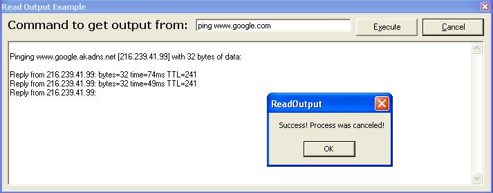



## Read Output from Command Prompt v2\.0 With Cancel Command\! No External Files\!

### Description

This program grabs the output from the Command Prompt (CMD.EXE or COMMAND.COM) and reads the output from whatever command you give it. NO EXTERNAL FILES! Really good for lots of programs, I really needed this so decided to share. This also kills the PID (ProcessID) when you cancel (thanks to Nick Campbeln for his PID Killing Function). This is also compatible with C/CPP programs (\n bug fixed). If you like this program please vote ;) Have fun!
 
### More Info
 

             |
---                |---
**Submitted On**   |2004-05-19 18:30:28
**By**             |[AmineHaddad](https://github.com/Planet-Source-Code/PSCIndex/blob/master/ByAuthor/aminehaddad.md)
**Level**          |Advanced
**User Rating**    |5.0 (100 globes from 20 users)
**Compatibility**  |VB 5\.0, VB 6\.0
**Category**       |[Coding Standards](https://github.com/Planet-Source-Code/PSCIndex/blob/master/ByCategory/coding-standards__1-43.md)
**World**          |[Visual Basic](https://github.com/Planet-Source-Code/PSCIndex/blob/master/ByWorld/visual-basic.md)
**Archive File**   |[Read\_Outpu1747705192004\.zip](https://github.com/Planet-Source-Code/aminehaddad-read-output-from-command-prompt-v2-0-with-cancel-command-no-external-files__1-53893/archive/master.zip)

